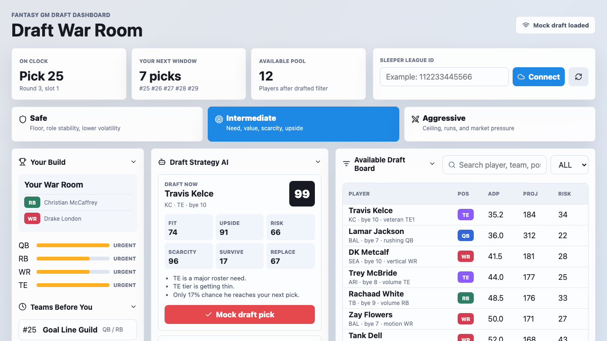

# Fantasy Football GM Command Center

A fantasy football GM command center for draft, waiver, trade, matchup, and roster strategy. The first iteration focuses on a live draft war room because it is the offseason, but the long-term product is meant to cover the full fantasy football season.



## What It Does

- Shows a draft board with drafted players removed from the available pool.
- Supports Safe, Intermediate, and Aggressive draft modes.
- Scores recommendations using roster fit, upside, risk, positional scarcity, replacement value, bye impact, and survival odds.
- Forecasts which positions teams before your next pick are likely to attack.
- Includes a Sleeper API service for loading league drafts, draft details, users, and draft picks.
- Polls live Sleeper draft picks once connected.

## Current Status

This is a v0.1 prototype. It is intentionally not finished yet, but it is a working first iteration with a clear product direction: start with draft intelligence, then expand into an all-season fantasy GM toolkit.

The app currently uses realistic mock player data for the recommendation model. Sleeper draft syncing is wired at the service/UI level, but production-quality player ID mapping, real projection imports, authentication-adjacent workflows, and deeper model validation still need work.

## Tech Stack

- React
- TypeScript
- Vite
- Sleeper public API integration
- CSS modules-style global stylesheet

## Getting Started

```bash
npm install
npm run dev
```

Then open:

```text
http://localhost:5173/
```

To verify a production build:

```bash
npm run build
```

## Roadmap

- Replace mock player projections with imported projection data.
- Improve Sleeper player ID matching against the full Sleeper player dataset.
- Add configurable league settings instead of assuming redraft half-PPR.
- Add historical draft tendencies for each manager.
- Add better survival probability modeling by draft slot, ADP, tier breaks, and roster construction.
- Add queue/watchlist behavior for players the model says to wait on.
- Add start/sit recommendations for weekly lineup decisions.
- Add waiver suggestions, including one-week-ahead bye planning.
- Add trade analyzer and team weakness scanning.
- Add future trade partner suggestions based on league-wide roster construction.
- Add weekly matchup previews and win-condition breakdowns.

## Notes

Sleeper integration is read-only. The app can sync draft state and recommend picks, but it does not make picks on behalf of a user.
